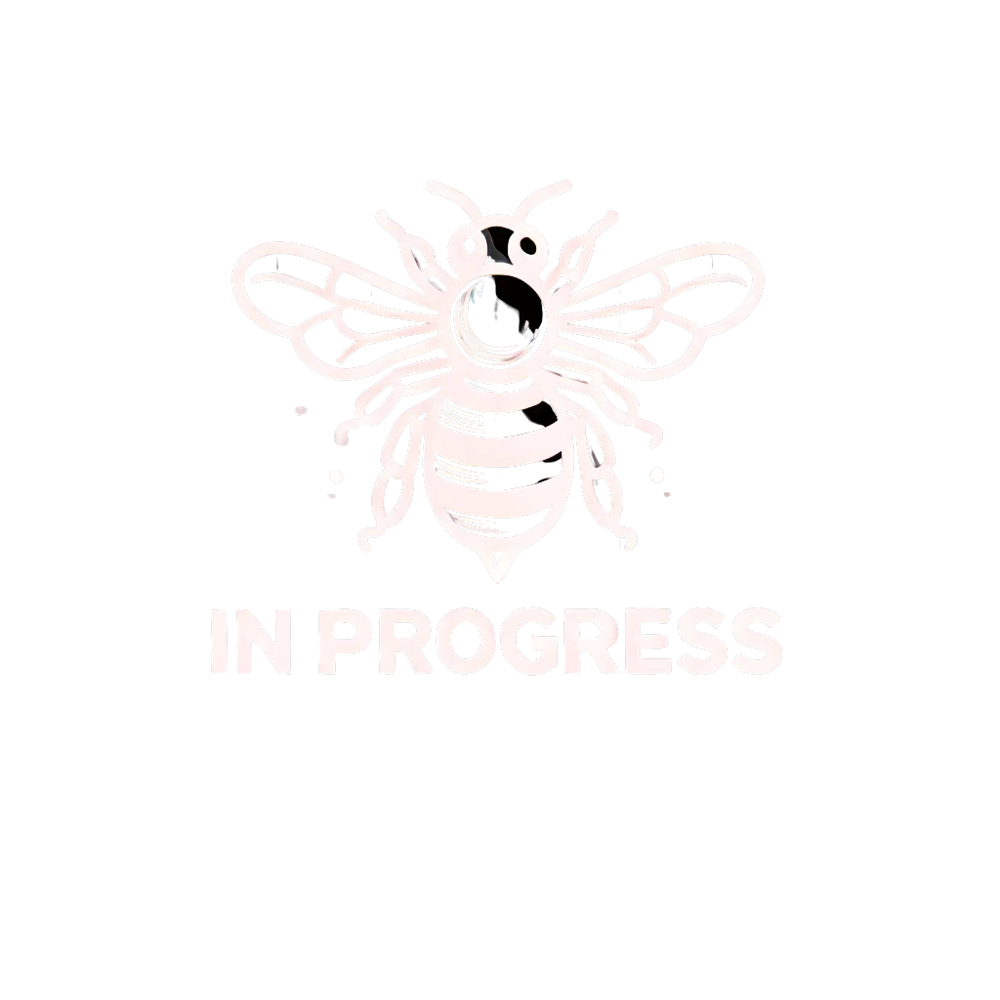

 jQuery

...in progress




<details className="dropdown-task">

  <summary>
  <strong>hamarosan</strong>
  
    A **jQuery** egy gyors, kis méretű és könnyen használható JavaScript könyvtár, amely leegyszerűsíti a DOM-kezelést, az eseménykezelést, az animációkat és az AJAX-hívásokat. Bár a modern JavaScript (ES6+) számos jQuery-funkciót natívan támogat, jQuery még mindig használatos bizonyos projektekben, különösen régebbi rendszerekben.

  </summary>


 **Fontos jQuery alapok JavaScript kapcsán**

 **1. A jQuery beillesztése**
 **CDN-ről**:
```html
<script src="https://code.jquery.com/jquery-3.6.0.min.js"></script>
```
 **Letöltve**:
Ha letöltötted a jQuery fájlt, akkor így hivatkozhatsz rá:
```html
<script src="jquery-3.6.0.min.js"></script>
```

---

 **2. A jQuery alap szintaxisa**
A jQuery szintaxisa így néz ki:
```js
$(selector).action();
```
- **`$`** → A jQuery rövidítése.
- **`selector`** → Az elem, amit kiválasztunk (pl. `"p"`, `"id"`, `".class"`).
- **`action()`** → A végrehajtandó művelet.

---

 **3. DOM-manipuláció jQuery-vel**
A jQuery legnagyobb előnye a **DOM-kezelés egyszerűsége**.

 **Elem kiválasztása**
```js
$("myDiv");  // ID alapján
$(".myClass");  // Osztály alapján
$("p");  // Összes <p> elem
```

 **Tartalom módosítása**
```js
$("myDiv").text("Új szöveg");  // Csak szöveg módosítás
$("myDiv").html("<b>Új HTML tartalom</b>");  // HTML kód beszúrása
$("myInput").val("Új érték");  // Input mező értékének módosítása
```

 **Elem hozzáadása**
```js
$("myList").append("<li>Új elem</li>");  // Beszúrás a végére
$("myList").prepend("<li>Új első elem</li>");  // Beszúrás az elejére
```

 **Elem törlése**
```js
$("myDiv").remove();  // Az elem eltávolítása a DOM-ból
$("myDiv").empty();  // Az elem tartalmának törlése, maga az elem megmarad
```

---

 **4. CSS-kezelés jQuery-vel**
 **CSS osztályok hozzáadása és eltávolítása**
```js
$("myDiv").addClass("highlight");  // Osztály hozzáadása
$("myDiv").removeClass("highlight");  // Osztály eltávolítása
$("myDiv").toggleClass("highlight");  // Kapcsolgatás
```

 **CSS tulajdonság módosítása**
```js
$("myDiv").css("color", "red");  // Szöveg színe piros lesz
$("myDiv").css({
  "color": "blue",
  "font-size": "20px"
});  // Több tulajdonság egyszerre
```

---

 **5. Eseménykezelés jQuery-vel**
A jQuery megkönnyíti az eseménykezelést.

 **Egyszerű kattintásesemény**
```js
$("myButton").click(function() {
  alert("Gombra kattintottál!");
});
```

 **Egér események**
```js
$("myDiv").hover(function() {
  $(this).css("background-color", "yellow");
}, function() {
  $(this).css("background-color", "white");
});
```

 **Billentyűzet események**
```js
$("myInput").keypress(function(event) {
  console.log("Lenyomott billentyű: " + event.key);
});
```

 **Események delegálása (dinamikusan létrehozott elemeknél fontos!)**
```js
$(document).on("click", ".dynamicButton", function() {
  alert("Dinamikus gombra kattintottál!");
});
```

---

 **6. AJAX-hívások jQuery-vel**
A jQuery megkönnyíti az AJAX-kéréseket.

 **Egyszerű GET-kérés**
```js
$.get("data.json", function(data) {
  console.log(data);
});
```

 **POST-kérés**
```js
$.post("submit.php", { name: "John", age: 30 }, function(response) {
  console.log("Válasz:", response);
});
```

 **AJAX teljes verzió**
```js
$.ajax({
  url: "data.json",
  method: "GET",
  dataType: "json",
  success: function(response) {
    console.log("Siker:", response);
  },
  error: function(xhr, status, error) {
    console.log("Hiba:", error);
  }
});
```

---

 **7. Animációk jQuery-vel**
A jQuery beépített animációs effektekkel rendelkezik.

 **Elem elrejtése és megjelenítése**
```js
$("myDiv").hide(1000);  // 1 másodperc alatt elrejti
$("myDiv").show(1000);  // 1 másodperc alatt megjeleníti
$("myDiv").toggle(1000);  // Kapcsolgatás
```

 **Fade effektek**
```js
$("myDiv").fadeOut(1000);
$("myDiv").fadeIn(1000);
$("myDiv").fadeToggle(1000);
```

 **Slide effektek**
```js
$("myDiv").slideUp(1000);
$("myDiv").slideDown(1000);
$("myDiv").slideToggle(1000);
```

---

 **Összegzés: Mikor érdemes jQuery-t használni?**
✅ Ha egy **régebbi** projektben kell dolgozni, ahol már jQuery van használatban.  
✅ Ha gyorsan kell **egyszerű DOM-műveleteket vagy animációkat** megvalósítani.  
✅ Ha egy **könnyű AJAX-kezelési** megoldás kell.  

❌ Ha modern ES6+ van kéznél, akkor **a natív JavaScript** és a **Vanilla JS** megfelelő alternatíva, mivel a legtöbb jQuery-funkciót natívan is meg lehet valósítani.

Ha új projektet fejlesztesz, **érdemes átgondolni**, hogy valóban szükség van-e jQuery-re, vagy jobb alternatíva a natív JavaScript.

</details>